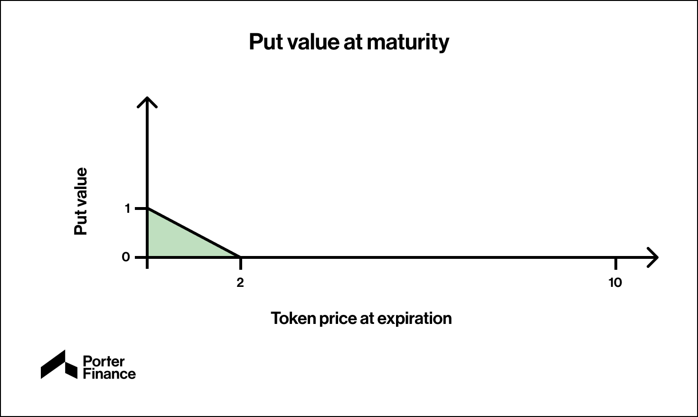

# Pricing

Pricing a convertible bond is much more complex than pricing a non-convertible bond due to the equity aspect. Therefore, it cannot be distilled into a simple equation.&#x20;

The convertibility adds a premium to the base value of the bond, dictated by the "Bond floor". As the underlying price increases, the bond price behaves less like a fixed income instrument and more like an equity.&#x20;

